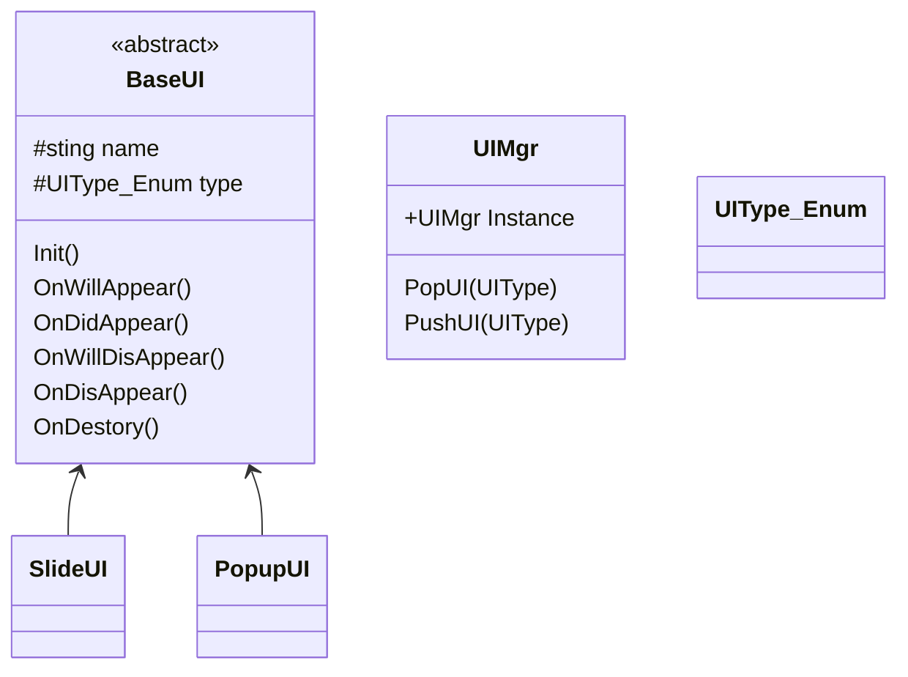

具体记不清了，

UIMgr负责管理UI，当Push时，就会显示Push的UI，对应页面关闭是再通过Pop将其弹出。

BaseUI定义了UI的基本生命周期，子类可以override来增加额外的逻辑。

```mermaid
classDiagram

BaseUI <-- SlideUI
BaseUI <-- PopupUI

class UIMgr {
	+UIMgr Instance
	PopUI(UIType)
	PushUI(UIType)
}

class BaseUI {
	<<abstract>>
	#sting name
	#UIType_Enum type
	Init()
	OnWillAppear()
	OnDidAppear()
	OnWillDisAppear()
	OnDisAppear()
	OnDestory()
}

class SlideUI {
	
}

class PopupUI {
	
}

class UIType_Enum {
	
}
```

